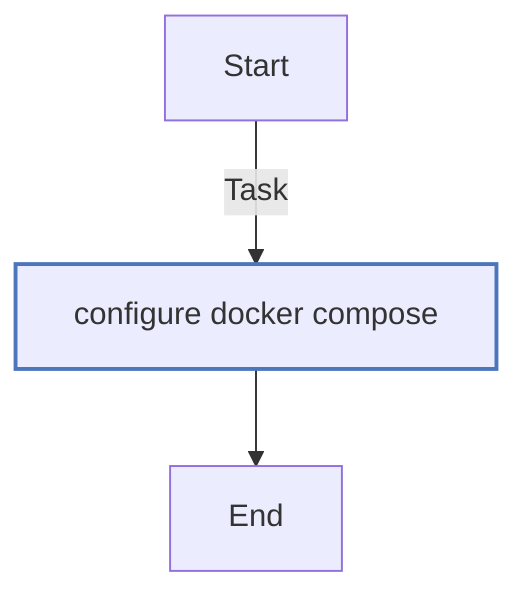
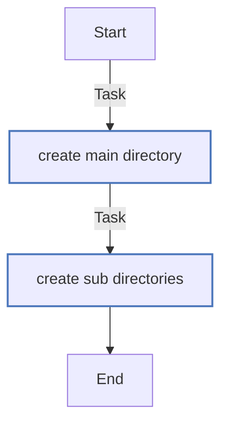
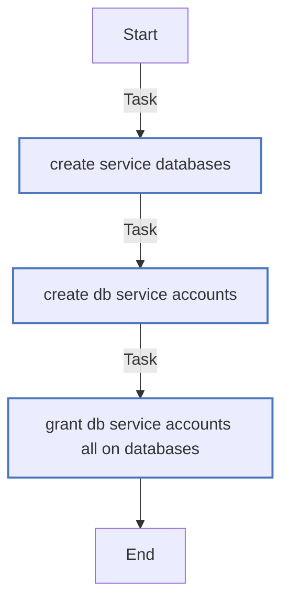
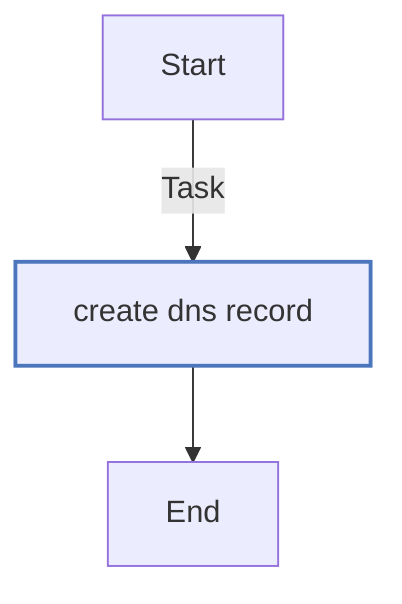
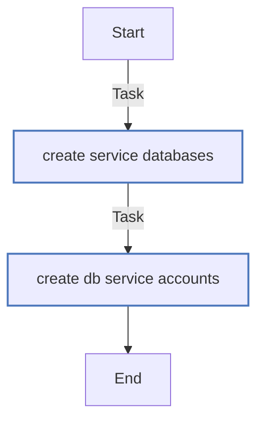
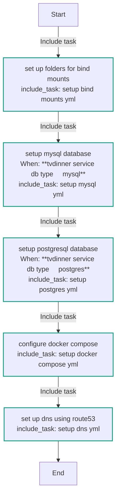
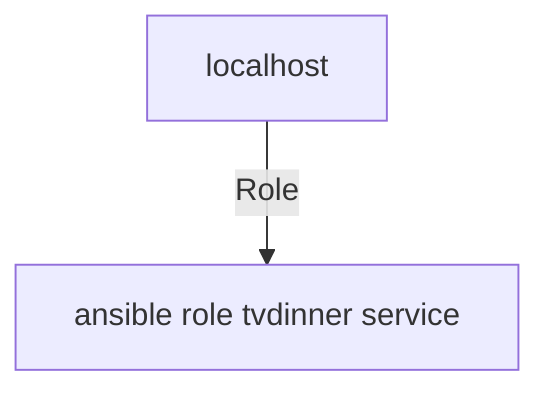

<!-- DOCSIBLE START -->

# 📃 Role overview

## ansible-role-tvdinner-service


Description: Install and configure a Docker service using a simple self-hosted approach


| Field                | Value           |
|--------------------- |-----------------|
| Readme update        | 30/03/2025 |


### Defaults

**These are static variables with lower priority**

#### File: defaults/main.yml

| Var          | Type         | Value       |Required    | Title       |
|--------------|--------------|-------------|-------------|-------------|
| [tvdinner_service_name](defaults/main.yml#L2)   | str   | `my_service` |    n/a  |  n/a |
| [tvdinner_service_image](defaults/main.yml#L3)   | str   | `my_image:latest` |    n/a  |  n/a |
| [tvdinner_service_enabled](defaults/main.yml#L4)   | bool   | `True` |    n/a  |  n/a |
| [tvdinner_service_dns](defaults/main.yml#L5)   | str   | `my_service` |    n/a  |  n/a |
| [tvdinner_service_dns_zone](defaults/main.yml#L6)   | str   | `example.com` |    n/a  |  n/a |
| [tvdinner_service_port](defaults/main.yml#L7)   | int   | `8080` |    n/a  |  n/a |
| [tvdinner_service_db_type](defaults/main.yml#L8)   | str   | `sqlite` |    n/a  |  n/a |
| [tvdinner_service_db_name](defaults/main.yml#L9)   | str   | `my_db` |    n/a  |  n/a |
| [tvdinner_service_db_user](defaults/main.yml#L10)   | str   | `db_user` |    n/a  |  n/a |
| [tvdinner_service_db_password](defaults/main.yml#L11)   | str   | `db_pass` |    n/a  |  n/a |
| [tvdinner_service_watchtower](defaults/main.yml#L12)   | bool   | `True` |    n/a  |  n/a |
| [tvdinner_service_homepage](defaults/main.yml#L13)   | dict   | `{'group': 'Services', 'name': 'My Service', 'description': 'My Service Description', 'icon': 'my_icon', 'weight': 100}` |    n/a  |  n/a |
| [tvdinner_service_nvidia_gpu](defaults/main.yml#L19)   | bool   | `False` |    n/a  |  n/a |
| [tvdinner_service_routing_mode](defaults/main.yml#L20)   | str   | `caddy` |    n/a  |  n/a |
| [tvdinner_service_env_vars](defaults/main.yml#L21)   | dict   | `{}` |    n/a  |  n/a |
| [tvdinner_service_mounts](defaults/main.yml#L22)   | list   | `[]` |    n/a  |  n/a |
| [tvdinner_service_mounts_path](defaults/main.yml#L23)   | str   | `/volumes` |    n/a  |  n/a |


### Tasks


#### File: tasks/setup_docker_compose.yml

| Name | Module | Has Conditions | Comments |
| ---- | ------ | --------- |  -------- |
| Configure Docker Compose | community.docker.docker_compose_v2 | False | Apply the Docker Compose file rendered from template |

#### File: tasks/setup_bind_mounts.yml

| Name | Module | Has Conditions | Comments |
| ---- | ------ | --------- |  -------- |
| Create main directory | file | False | Create top-level directory for the bind mounts |
| Create sub-directories | file | False | Create one directory for each bind mount exposed as a volume |

#### File: tasks/setup_postgres.yml

| Name | Module | Has Conditions | Comments |
| ---- | ------ | --------- |  -------- |
| Create service databases | community.postgresql.postgresql_db | False |  |
| Create DB service accounts | community.postgresql.postgresql_user | False |  |
| Grant DB service accounts ALL on databases | community.postgresql.postgresql_privs | False |  |

#### File: tasks/setup_dns.yml

| Name | Module | Has Conditions | Comments |
| ---- | ------ | --------- |  -------- |
| Create DNS record | amazon.aws.route53 | False | Create a DNS record pointing to the host |

#### File: tasks/setup_mysql.yml

| Name | Module | Has Conditions | Comments |
| ---- | ------ | --------- |  -------- |
| Create service databases | mysql_db | False |  |
| Create DB service accounts | mysql_user | False |  |

#### File: tasks/main.yml

| Name | Module | Has Conditions | Comments |
| ---- | ------ | --------- |  -------- |
| Set up folders for bind mounts | include_tasks | False |  |
| Setup MySQL database | include_tasks | True | Only set up MySQL if `service_db_type` is `mysql`. |
| Setup PostgreSQL database | include_tasks | True | Only set up MySQL if `service_db_type` is `postgres`. |
| Configure Docker Compose | include_tasks | False |  |
| Set up DNS using Route53 | include_tasks | False |  |


## Task Flow Graphs


### Graph for setup_docker_compose.yml




### Graph for setup_bind_mounts.yml




### Graph for setup_postgres.yml




### Graph for setup_dns.yml




### Graph for setup_mysql.yml




### Graph for main.yml




## Playbook

```yml
---
- hosts: localhost
  remote_user: root
  roles:
    - ansible-role-tvdinner-service

```
## Playbook graph


## Author Information
Joe Stump <joe@joestump.net>

#### License

MIT

#### Minimum Ansible Version

2.9

#### Platforms

- **Ubuntu**: ['jammy', 'luna']

<!-- DOCSIBLE END -->